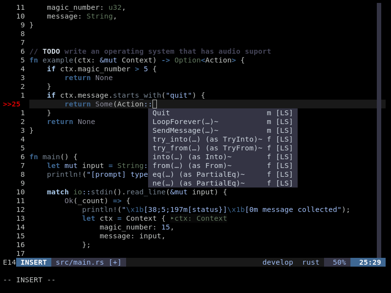
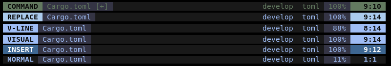

> A cool tone vim theme





## Install
1. Use any plugin manager you want. For example with [vim-plug](https://github.com/junegunn/vim-plug) just add `Plug 'slugbyte/wet-vim'` to your config.
2. Add the following lines to your vim config.
``` vim
set background=dark
colorscheme wet

" if your terminal has 24bit color support you should also add the follwing line
set termguicolors
```

## Features
* Extra filetype highlighting for html, json, and markdown
* Plugin support
  * [coc.nvim](https://github.com/neoclide/coc.nvim)
  * [GitGutter](https://github.com/jisaacks/GitGutter)
  * [lualine.nvim](https://github.com/nvim-lualine/lualine.nvim)

## [lualine.nvim](https://github.com/nvim-lualine/lualine.nvim) setup
Add the following code to a nvim lua config
``` lua 
local wet_lualine = require('wet').lualine

-- you can modify wet_lualine here if you want

require('lualine').setup {
  options = { theme = wet_lualine },
}
```

## License 
[Unlicense](http://unlicense.org)

